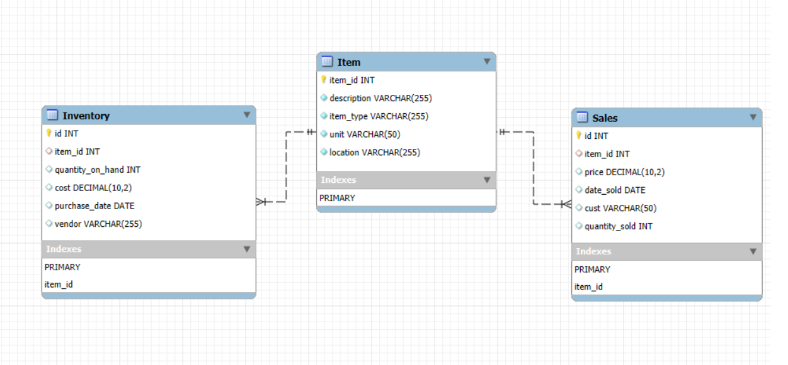
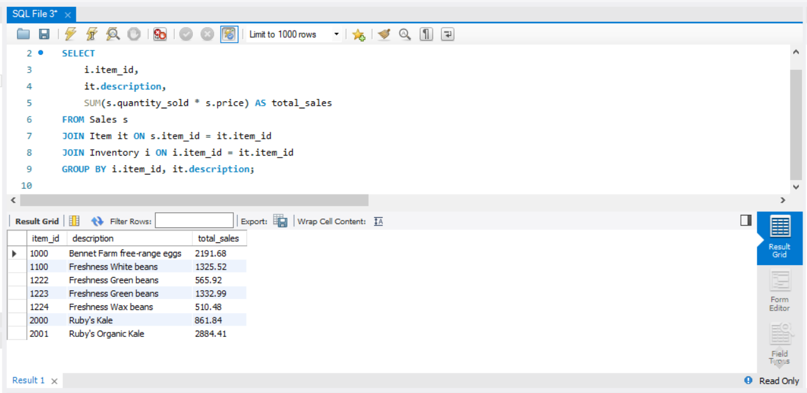
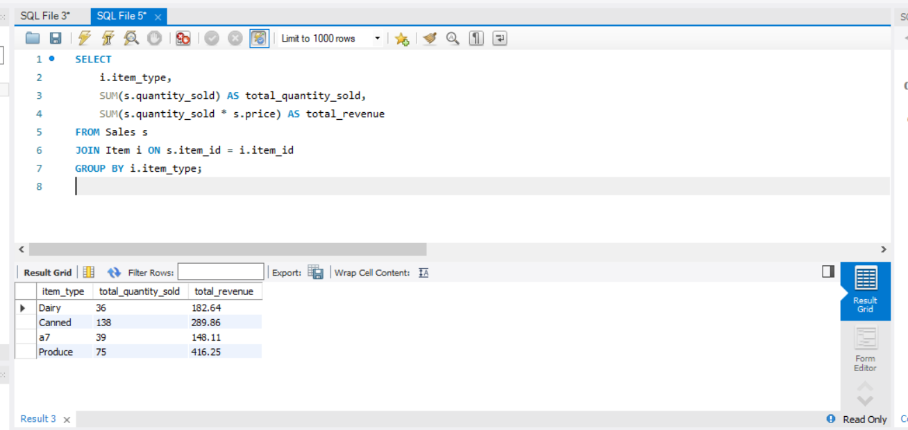

## 📂 SQL Folder

### 📖 Overview
This folder contains all the **SQL-related files** for the project, including scripts for creating tables, running queries and EER Diagram.

---

### 🗂️ Folder Structure
Here’s what you’ll find in this folder:

---

### 📄 `docs/` Folder
This folder contains **documentation** related to the database schema:
- **`eer_diagram.png`**: A visual representation of the database schema (Entity-Relationship Diagram).

---

### 📜 `scripts/` Folder
This folder contains **SQL scripts** for setting up and querying the database:
- **`create_tables.sql`**: Creates the database and tables.
- **`queries.sql`**: Contains example queries for analyzing the data.
#### Total sales by item

#### Total quantity of items sold and total revenue per item type

#### Get the total quantity of items sold within a specific date range

  
---
